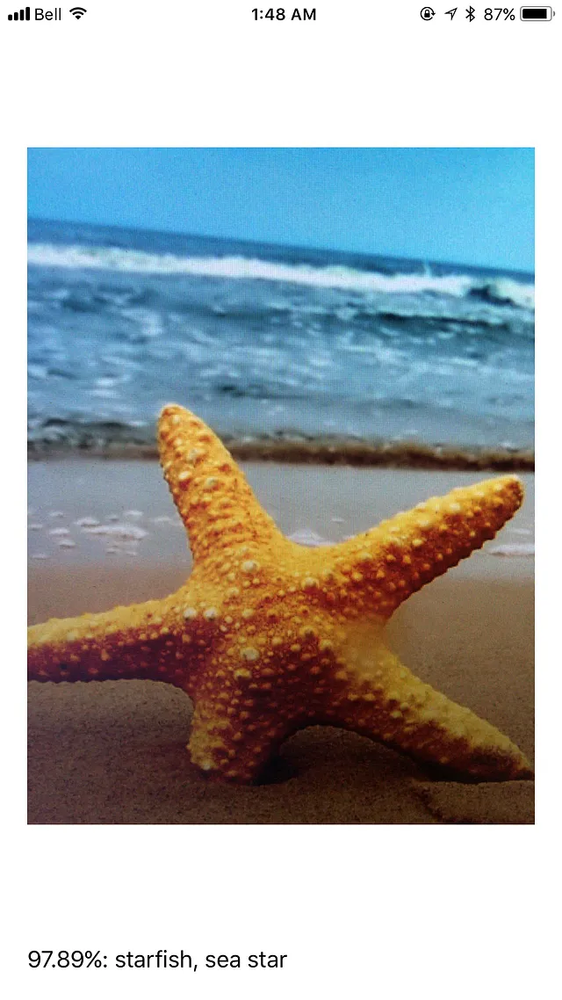
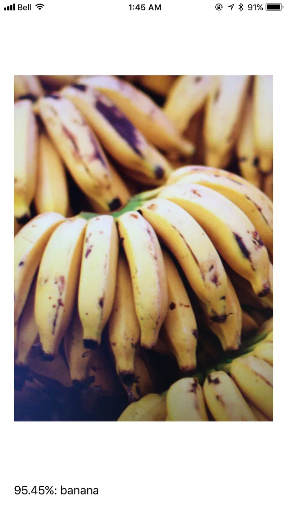
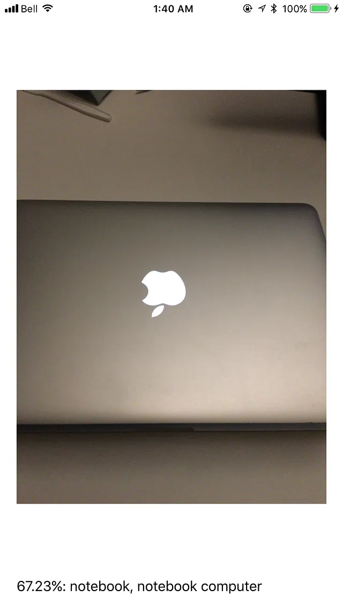
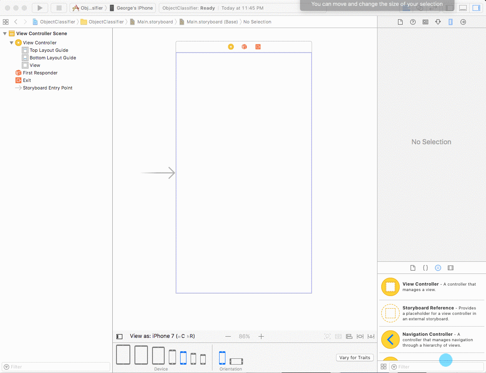
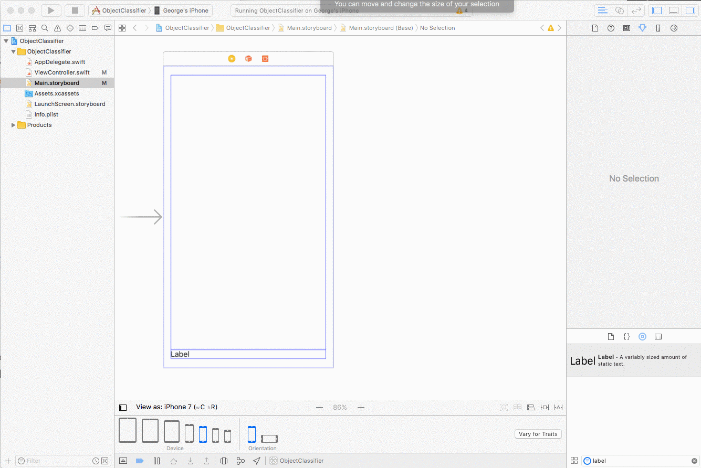
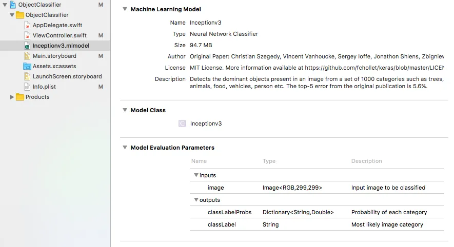

#blog/post

|                                                                             |                                                                         |                                                                           |
| :-------------------------------------------------------------------------: | :---------------------------------------------------------------------: | :-----------------------------------------------------------------------: |
|  |  |  |

The CoreML and Vision frameworks were amongst some of the coolest new tech announced at WWDC on Wednesday (7 Jun).

CoreML makes it really easy to integrate pre-trained machine learning models into your iOS app using either Swift or Objective C. It abstracts out various details of how the model works and lets the developer focus on just the code. CoreML even decides whether to run your model on the device's CPU (typically for memory heavy models), or on the GPU (typically for compute heavy models) and exposes a set of easy to use developer APIs. At the time of writing, Apple also provides a tool to easily convert models built using Caffe, Keras and Scikit-Learn into a .mlmodel file that can be consumed in Xcode. Some supported model types include neural networks (feedforward, convolutional and recurrent), tree ensembles, support vector machines and liner models including linear and logistic regression.

Amongst various other computer vision related tasks, the Vision API also plays nice with CoreML and makes it easy to feed it visual data.

I have limited Swift experience, but couldn't wait to try out the CoreML framework. I decided to try building an image classifier, similar to what was demoed at WWDC. The app should take frames from the device's camera and output top predictions of what the camera is pointed at. This blog explains how you can create such an app.

## Requirements

iOS 11 Beta (Get this straight from Apple if you're enrolled in the paid developer program, or download for free from https://beta.applebetas.co)
Xcode 9 Beta

## UI and Camera setup

We'll start by simply displaying the camera output on screen, and then adding the machine learning part to it. Let's go ahead and create a single-view iOS application in Xcode with swift. We want the UI to simply show an area for the camera output, along with a text area below it to show the prediction. Let's create this by dragging and dropping a UIView and a Label into Main.storyboard and applying the appropriate constraints.



Click on the label field, go to the attributes inspector on the right sidebar, and change 'Lines' from 1 to 4. We'll need this in order to display multiple predictions returned by the model. Let's also connect our UIView and Label to `ViewController.swift` by Ctrl + dragging them into the file.



In order to be able to obtain frames from the camera, iOS requires you to add a 'Privacy — Camera Usage Description' key in Info.plist. You can enter any value for this key that describes why your app requires camera access. In `ViewController.swift` let's now import `AVFoundation`, implement the `AVCaptureVideoDataOutputSampleBufferDelegate` protocol and add code to fetch camera frames and display them on our `cameraView` UIView. Your code should look something like this —

```swift
import UIKit
import AVFoundation

class ViewController: UIViewController, AVCaptureVideoDataOutputSampleBufferDelegate {
    // Connect InterfaceBuilder views to code
    @IBOutlet weak var classificationText: UILabel!
    @IBOutlet weak var cameraView: UIView!

    // Create a layer to display camera frames in the UIView
    private lazy var cameraLayer: AVCaptureVideoPreviewLayer = AVCaptureVideoPreviewLayer(session: self.captureSession)
    // Create an AVCaptureSession
    private lazy var captureSession: AVCaptureSession = {
        let session = AVCaptureSession()
        session.sessionPreset = AVCaptureSession.Preset.photo
        guard
            let backCamera = AVCaptureDevice.default(.builtInWideAngleCamera, for: .video, position: .back),
            let input = try? AVCaptureDeviceInput(device: backCamera)
            else { return session }
        session.addInput(input)
        return session
    }()

    override func viewDidLoad() {
        super.viewDidLoad()
        self.cameraView?.layer.addSublayer(self.cameraLayer)
        let videoOutput = AVCaptureVideoDataOutput()
        videoOutput.setSampleBufferDelegate(self, queue: DispatchQueue(label: "MyQueue"))
        self.captureSession.addOutput(videoOutput)
        self.captureSession.startRunning()
    }

    override func viewDidLayoutSubviews() {
        super.viewDidLayoutSubviews()
        self.cameraLayer.frame = self.cameraView?.bounds ?? .zero
    }

    override func didReceiveMemoryWarning() {
        super.didReceiveMemoryWarning()
        // Dispose of any resources that can be recreated.
    }
}

```

Running your app on device should now show camera frames on screen.

## Machine Learning

It's now time to think about how to integrate an object detection machine learning model into our app. Let's use an Inception V3 pre-trained model available online. A copy can be downloaded directly from apple ([Download CoreML Model](https://docs-assets.developer.apple.com/coreml/models/Inceptionv3.mlmodel)). Alternatively, you can use your own model and convert it to a .mlmodel file using a [python tool](https://pypi.python.org/pypi/coremltools) provided by apple.

Once you have the model file, simply drag and drop the file into Xcode. Clicking on the model file should show you information on the shapes of inputs and outputs. In this case, you'll see that the input is an image of size 299 x 299; the output is a dictionary where the key is a string describing the object found and the value is a probability describing how confident the prediction is.



Let's now import the `Vision` and `CoreML` APIs and and declare an array of `VNRequests` on the `ViewController` class. This array will hold any machine learning models we want to run on each image. In our case, we'll just have the 1 model that classifies images. Let us also define a `setupVision()` function to set up our computer vision tasks, and a `handleClassifications` function to act as the completion handler for our `VNCoreMLRequest`. We'll wire everything up by implementing the `captureOutput(_:didOutput:from:)` method in the `AVCaptureVideoDataOutputSampleBufferDelegate` specification. This notifies the delegate every time a new video frame is received.

```swift
// ViewController.swift
private var requests = [VNRequest]()

override func viewDidLoad() {
    // Same as before
    setupVision()
}

func setupVision() {
    guard let visionModel = try? VNCoreMLModel(for: Inceptionv3().model)
        else { fatalError("Can't load VisionML model") }
    let classificationRequest = VNCoreMLRequest(model: visionModel, completionHandler: handleClassifications)
    classificationRequest.imageCropAndScaleOption = VNImageCropAndScaleOptionCenterCrop
    self.requests = [classificationRequest]
}

func handleClassifications(request: VNRequest, error: Error?) {
    guard let observations = request.results
        else { print("no results: \(error!)"); return }
    let classifications = observations[0...4]
        .flatMap({ $0 as? VNClassificationObservation })
        .filter({ $0.confidence > 0.3 })
        .map {
            (prediction: VNClassificationObservation) -> String in
            return "\(round(prediction.confidence * 100 * 100)/100)%: \(prediction.identifier)"
        }
    DispatchQueue.main.async {
        print(classifications.joined(separator: "###"))
        self.classificationText.text = classifications.joined(separator: "\n")
    }
}

func captureOutput(_ output: AVCaptureOutput, didOutput sampleBuffer: CMSampleBuffer, from connection: AVCaptureConnection) {
    guard let pixelBuffer = CMSampleBufferGetImageBuffer(sampleBuffer) else {
        return
    }
    var requestOptions:[VNImageOption : Any] = [:]
    if let cameraIntrinsicData = CMGetAttachment(sampleBuffer, kCMSampleBufferAttachmentKey_CameraIntrinsicMatrix, nil) {
        requestOptions = [.cameraIntrinsics:cameraIntrinsicData]
    }
    let imageRequestHandler = VNImageRequestHandler(cvPixelBuffer: pixelBuffer, orientation: 1, options: requestOptions)
    do {
        try imageRequestHandler.perform(self.requests)
    } catch {
        print(error)
    }
}

```

Your entire `ViewController.swift` should look something like this:

```swift
// ViewController.swift
import UIKit
import AVFoundation
import CoreML
import Vision

class ViewController: UIViewController, AVCaptureVideoDataOutputSampleBufferDelegate {
    // Connect UI to code
    @IBOutlet weak var classificationText: UILabel!
    @IBOutlet weak var cameraView: UIView!

    private var requests = [VNRequest]()
    private lazy var cameraLayer: AVCaptureVideoPreviewLayer = AVCaptureVideoPreviewLayer(session: self.captureSession)
    private lazy var captureSession: AVCaptureSession = {
        let session = AVCaptureSession()
        session.sessionPreset = AVCaptureSession.Preset.photo
        guard
            let backCamera = AVCaptureDevice.default(.builtInWideAngleCamera, for: .video, position: .back),
            let input = try? AVCaptureDeviceInput(device: backCamera)
            else { return session }
        session.addInput(input)
        return session
    }()

    override func viewDidLoad() {
        super.viewDidLoad()
        self.cameraView?.layer.addSublayer(self.cameraLayer)
        let videoOutput = AVCaptureVideoDataOutput()
        videoOutput.setSampleBufferDelegate(self, queue: DispatchQueue(label: "MyQueue"))
        self.captureSession.addOutput(videoOutput)
        self.captureSession.startRunning()
        setupVision()
    }

    override func viewDidLayoutSubviews() {
        super.viewDidLayoutSubviews()
        self.cameraLayer.frame = self.cameraView?.bounds ?? .zero
    }

    func setupVision() {
        guard let visionModel = try? VNCoreMLModel(for: Inceptionv3().model)
            else { fatalError("Can't load VisionML model") }
        let classificationRequest = VNCoreMLRequest(model: visionModel, completionHandler: handleClassifications)
        classificationRequest.imageCropAndScaleOption = VNImageCropAndScaleOptionCenterCrop
        self.requests = [classificationRequest]
    }

    func handleClassifications(request: VNRequest, error: Error?) {
        guard let observations = request.results
            else { print("no results: \(error!)"); return }
        let classifications = observations[0...4]
            .flatMap({ $0 as? VNClassificationObservation })
            .filter({ $0.confidence > 0.3 })
            .sorted(by: { $0.confidence > $1.confidence })
            .map {
                (prediction: VNClassificationObservation) -> String in
                return "\(round(prediction.confidence * 100 * 100)/100)%: \(prediction.identifier)"
            }
        DispatchQueue.main.async {
            print(classifications.joined(separator: "###"))
            self.classificationText.text = classifications.joined(separator: "\n")
        }
    }

    func captureOutput(_ output: AVCaptureOutput, didOutput sampleBuffer: CMSampleBuffer, from connection: AVCaptureConnection) {
        guard let pixelBuffer = CMSampleBufferGetImageBuffer(sampleBuffer) else {
            return
        }
        var requestOptions:[VNImageOption : Any] = [:]
        if let cameraIntrinsicData = CMGetAttachment(sampleBuffer, kCMSampleBufferAttachmentKey_CameraIntrinsicMatrix, nil) {
            requestOptions = [.cameraIntrinsics:cameraIntrinsicData]
        }
        let imageRequestHandler = VNImageRequestHandler(cvPixelBuffer: pixelBuffer, orientation: 1, options: requestOptions)
        do {
            try imageRequestHandler.perform(self.requests)
        } catch {
            print(error)
        }
    }

    override func didReceiveMemoryWarning() {
        super.didReceiveMemoryWarning()
    }
}
```

At this point your app should be recognizing objects its pointed at!

All code for the project can be found at https://github.com/G2Jose/ObjectClassifier

## References

- [WWDC 2017](https://developer.apple.com/videos/wwdc2017)
- [Vision Framework](https://developer.apple.com/documentation/vision)
- [CoreML Framework](https://developer.apple.com/documentation/coreml)
