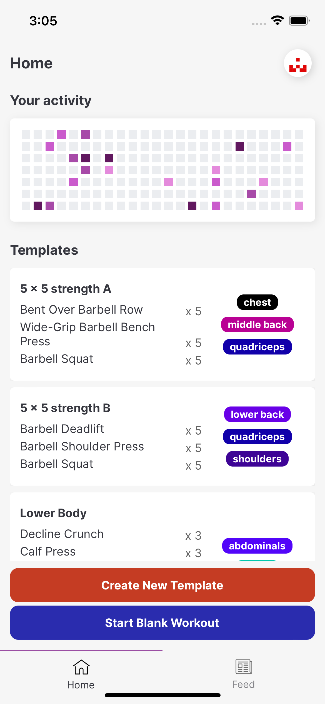
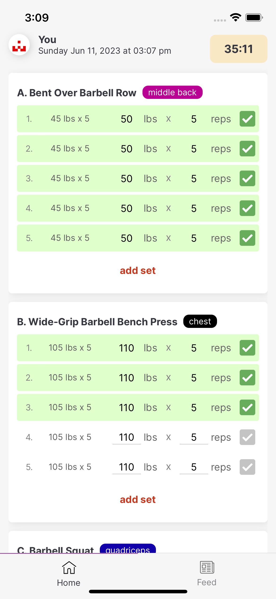
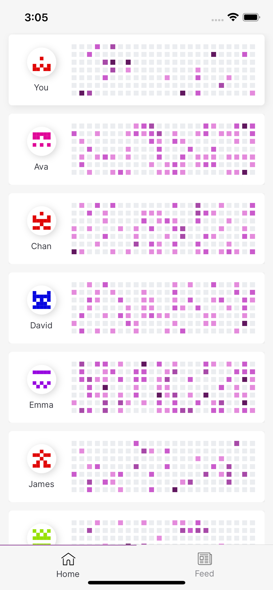

#blog/post #projects/titan

I recently decided to build Titan Workout Tracker, a simple to use yet fully featured workout tracker for strength training and body weight based exercises.

There are a few different reasons I wanted to build this app: 

* I found existing workout trackers (I've used [Strong](https://www.strong.app/), [Hevy](https://www.hevyapp.com/) and a few others) to be rather bland (I know, it's subjective), or lacking in key features. Many of them locked out essential features unless I signed up for an expensive monthly subscription. Strong for example only allows you to have 3 workout plans, and a couple of charts to track your progress on the free version. 
* I've recently started getting back into working out, and so have a few of my friends. I couldn't find a nicely built, reasonably priced app that allowed us to follow each other's progress.
* There have been a lot of developments in AI, including tools that should making it easier to build things. I wanted to see exactly how I could use some of these, and if they live up to the hype.
* I often start many personal projects, but rarely complete them. I wanted to challenge myself to actually see some of them through.

I saw an opportunity here to build a beautifully crafted app to motivate my friends and me to work out more, and hence Titan was born. 

After about 2 weeks of writing code on evenings, nights and weekends after work and lots of coffee, v1.0.0 of the app is out on the App Store.

Here are some early screenshots of what I've built:

|                                                                                |                                                                                                                |                                                                        |
| ------------------------------------------------------------------------------ | -------------------------------------------------------------------------------------------------------------- | ---------------------------------------------------------------------- |
|          |                                    |  |
|  |  |                                                                        |

This is just the beginning, and I plan to document my experience building this product on this blog. 

Want to try the app out? It's available [here](https://titangymapp.com) for Android & iOS!

