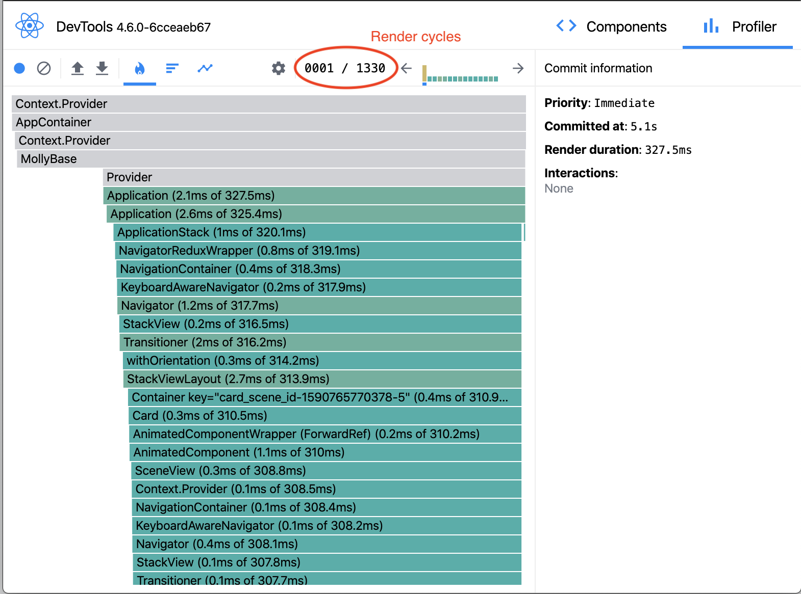
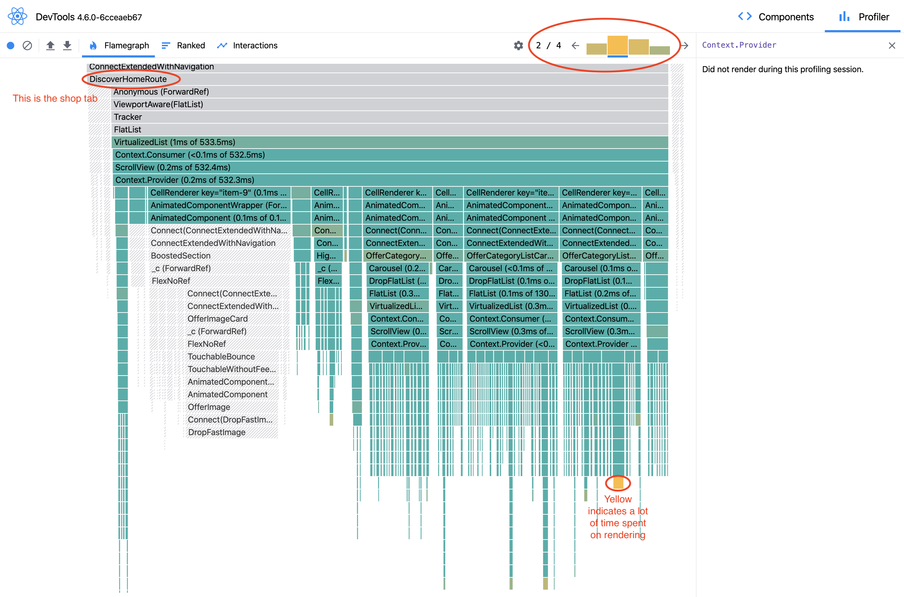
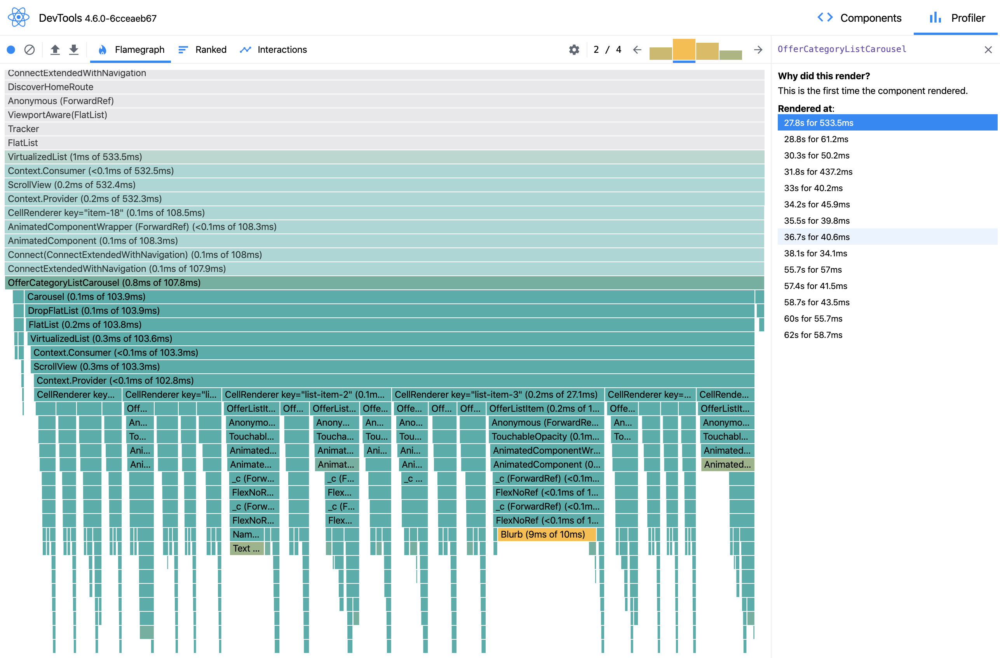
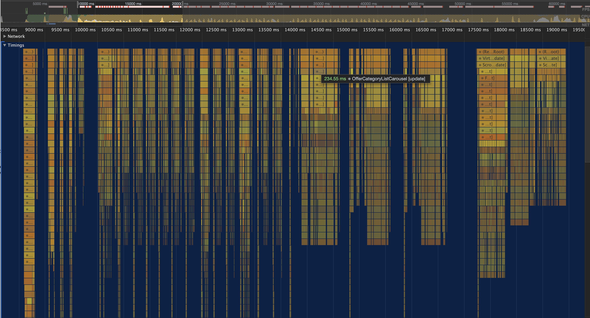
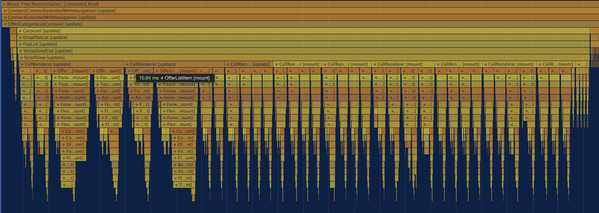
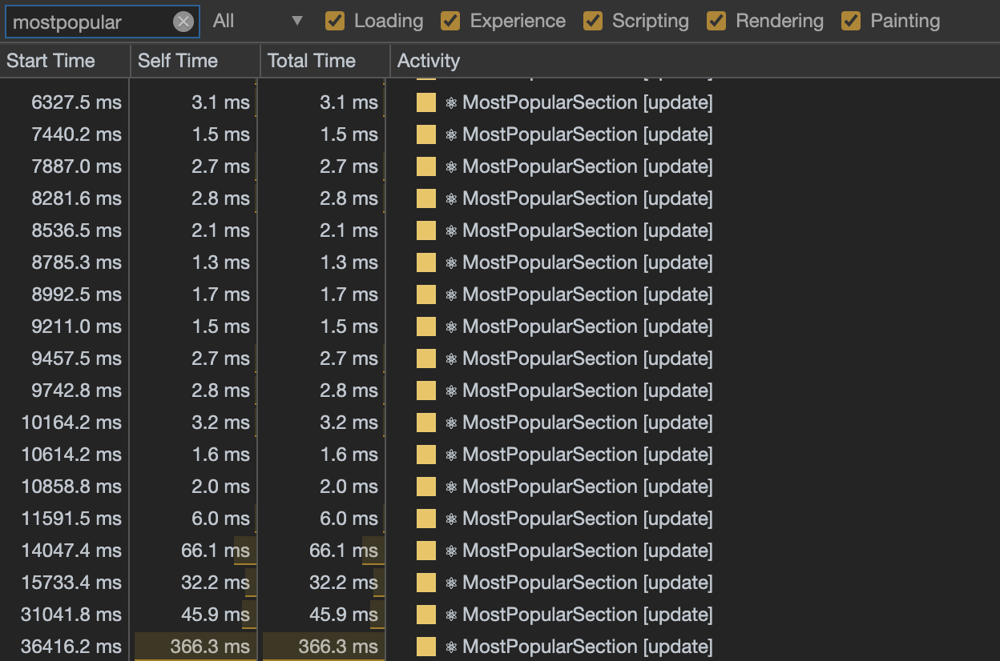
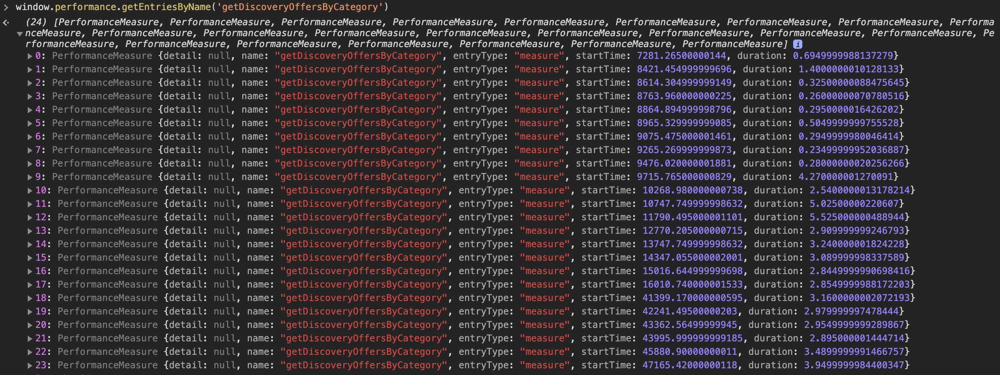
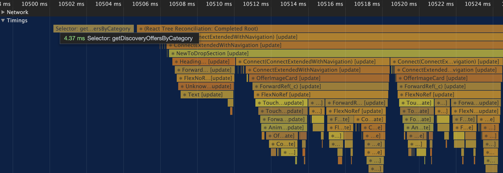
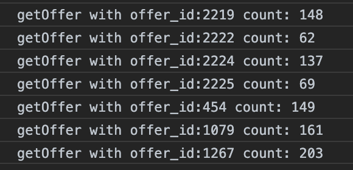

#blog/post #react #react-native

Over the past few weeks, the engineering team at Drop has been doing some really great work on improving app performance. There are several areas that ultimately impact what users perceive as 'app performance' that are being worked on. One such area is app rendering - i.e given that data from the API has been fetched, or given that the user has performed an action, how long it takes the app to render (or update) a view.

## Intro to React Native

As most of us know, we took an early bet on React Native back when Drop was founded. React native allows us to maintain a single codebase written in typescript that powers both the Android and iOS app.

The react native app is composed of a few main parts at a very high level:

- **Components**
  Components are units of UI. Every view on the app is created by composing different components (i.e a component can contain other components and so on). Components get their data from something called 'props', and update whenever this data changes. Code for a simple component might look something like this:

```typescript
Button = props => <Touchable backgroundColor={props.backgroundColor} />
```

Components re-render anytime data given to them via props change. In this example, the button would re-render if the `backgroundColor` it's given changes

- **Redux state**
  The entire app can be thought of as a giant state machine, where the UI is the output of all the data contained in the redux state at any point in time. Data fetched by the app & actions performed by the user cause the redux state to be updated, which then cause views to update
  Eg:

```typescript
// redux state before making a request to /api/offers
{
  entities: {offers: [], categories: []}
  ids: {offers: [], categories: []}
}
// redux state after data from /api/offers is received:
{
  entities: {offers: [{id: 1, name: walmart, logo: ...}, {id: 2, name: sephora ...}..], categories: []}
  ids: {offers: [1, 2, ...], categories: []}
}
// after data from /api/categories is received
{
  entities: {
    offers: [{id: 1, name: walmart, logo: ...}, {id: 2, name: sephora ...}..],
    categories: [{id: 1, name: 'Most Popular'}, ...]
  }
  ids: {offers: [1, 2, ..], categories: [1, ...]}
}
```

- **Selectors**
  These are functions that read relevant data from the redux state and provide it to components. All selector functions used by components are re-run any time the redux state is updated. Since selectors provide data from the redux store to components, this means that anytime the redux state updates, components are re-rendered, unless memoized correctly. This can lead to what a user might perceive as lag.

Eg:

```typescript
// Selectors
getOffer = (state, id) => {
  expensiveComputations()
  return state.entities.offer[id]
}
getAllOffers = state =>
  Object.keys(state.ids.offers).map(offerId => getOffer(state, offerId))
getMostPopularOffers = state => getAllOffers(state).filter(isOfferMostPopular)
```

In the above example, the `getMostPopularOffers` selector would rerun anytime either `state.ids.offers` or `state.entities.offer` updates, even if there are no actual changes to offers to be shown in the Most Popular section.

## Profiling performance

Now we know what causes components to re-render. But how do we go about finding where this happens, particularly where this happens more than it should? There are a few different tools I've found are useful for this:

### 1. React Profiler

The React Profiler is a development tool that lets you inspect the rendering lifecycles of components. Using it is as simple as running the app in a simulator, enabling debugging, and recording a performance snapshot while interacting with the app.

Starting up the simulator, and recording a performance profile from app open all the way to when we're able to dismiss the launchpad, this is what the profiler shows:



This tells us there are 1330 'render cycles' happening. Render cycles are react's way of optimizing UI updates - if 20 components need to update within a small time interval, react batches all these up into a single update cycle as opposed to 20 different ones. 1330 cycles here are too many for a human to inspect one by one, and the large number in itself may not indicate issues. To make it easier to find issues, the tool allows us to filter for just render cycles that take more than a given amount of time. Filtering for cycles that take more than an arbitrary `> 150ms` shows us 4 potentially problematic render cycles.



The view above shows bars corresponding to the component tree, and where the color indicates rendering time (closer to blue = less time, closer to yellow = more time). Narrowing into the item marked in yellow here tells us a few things:



1. This component is part of the `OfferCategoryListCarousel` component, which corresponds to the unbundled categories view on the shop tab.
2. The sidebar on the right tells us that this instance of the component has rendered 14 times during the profiling period, adding up to a total of ~1.5s (Note that the absolute value in development mode here may be different from the experience on a production build, which is a lot more optimized. This is however, directionally informative). We know from the API requests we make that this component should just depend on 2 calls (/offers & /categories) and that a given category view shouldn't need to re-render that many times. We know also that the shop tab contains about 7 such category carousels using the same logic, so optimizing this could have a sizeable effect.

### 2. Chrome performance profiler

The Chrome performance profiler is yet another, more general purpose devtool that lets you inspect the performance of your javascript app or website. The steps to record a performance snapshot are very similar to the ones used for the react profiler - I.e open chrome, enable debugging in the simulator, hit record, perform actions you want to profile.

In contrast to the react profiler that shows individual render cycles, the output of the Chrome profiler is continuous, time based flame graph (i.e render durations correspond to the size of the bars)



Hovering on segments in this view shows the amount of time spent on rendering / updating components. We can see for example in the screenshot above that it took 234ms to render the `OfferCategoryListCarousel` in its current render cycle.

It is also possible to zoom into time intervals of interest to see a much more granular view of how much time is spent rendering sub-components. We can for example see here that there is a good chunk of time spent rendering `OfferListItem` (which correspond to each offer in the unbundled category view)



Another nice thing about this view is that you can search by component name to find all render / update cycles associated with it.


### 3. Chrome User timing API

The User Timing API allows us to set arbitrary start and stop marks, and inspect time intervals between them with a high level of accuracy ([~5 microseconds](https://developer.mozilla.org/en-US/docs/Web/API/DOMHighResTimeStamp)) . The chrome performance profiling described above technically relies on this API under the hood.

Start and stop times can be set by calling `window.performance.mark(startOrStopTag)`, and can be sent to the chrome profiling view to be visualized by calling `window.performance.measure('name', 'startTag', 'endTag')`. Measured values can also be accessed directly in the console by calling `window.performance.getEntriesByType('measure')`

Adding this profiling code code to the `getDiscoveryOffersByCategory` function (this is used to get offer give a category id) for example tells me that it's called 24 times on app open, and add up to a total of about 56ms.



It’s also possible to overlay this on a timeline view for easy comparison against time taken for rendering



Adding some profiling code to the `getOffer` function, I can see that it adds up to about 1.8s, even before any user interaction (note that this is just the time spent on running the selector, not including rendering time). This is a good indicator that this function should be optimized.

### 4. console.count

Another tool I've found useful in debugging performance is the `console.count(value)` function. This is a really simple function that does 2 things:

- Prints the `value` provided to it
- Counts how many times the provided `value` is printed

This function can for example be inserted into a component's `render` function to see how many times it updates, or into a selector function to see how many times it gets called with a given argument.

Plopping this into the `getOffer` selector function (this is a function that's used throughout the codebase to look up offers, given offer ids), we see something like:



I.e this function was called 203 different times to look up data for the offer with id `1267`. This is a **large** number of calls to the same function with (mostly) the same arguments, and indicates that this is a really good candidate for memoization.

## Fixing rendering performance issues

We've seen a few ways of identifying performance bottlenecks in react native. Now let's look at how to fix them.

The most common cause of rendering performance issues is improper selector memoization. Memoization is an optimization technique where results of expensive computations are stored, so that subsequent calls results in simple lookups, instead of re-running the expensive computations. This technique trades off higher memory usage for lower processing usage.

### 1. Use `reselect`

Reselect is a library that lets us write memoized compound selectors. Using this makes it so that if selector C is built using selectors A and B, C only re-computes if either A or B recomputes, and not on every state change. Here's an example:

```typescript
// BAD - without memoization
// This would re-run on every state change and lead to components re-rendering without reason
getAllCategories = (state) => {
  categoryIds.map = getCategoryIds(state)
  categoryEntities = getCategoryEntities(state)
  return categoryIds.map(categoryId => categoryEntities[categoryId])
}

// GOOD - with memoization
// This would only re-run when `state.entities.category` or `state.ids.category` update
getAllCategories = createSelector(getCategoryIds, getCategoryEntities, (categoryIds.map, categoryEntities) => categoryIds.map(categoryId => categoryEntities[categoryId]))
```

### 2. Do not write selectors that take multiple arguments

Standard redux selectors should only take a single argument - the redux state. However, there are times when we need to return a value determined by something not available in redux like local component state (eg: whether a checkbox is enabled or disabled). The recommended approach here is to have selectors that return [lookup / curried functions](https://en.wikipedia.org/wiki/Currying)

```typescript
// BAD - this is an anti-pattern, and is hard to memoize and will re-run unnecessarily
getIsFeatureEnabled = (state, flagName) => {
  globalFlags = getGlobalFeatureFlags(state)
  userFlags = getUserFeatureFlags(state)
  allFlags = { ...globalFlags, ...userFlags }
  return allFlags[flagName]
}

// GOOD - return a memoized lookup function
getIsFeatureEnabled = createSelector(
  getGlobalFeatureFlags,
  getUserFeatureFlags,
  (globalFlags, userFlags) => {
    const allFlags = { ...globalFlags, ...userFlags }
    return flagName => allFlags[flagName]
  }
)
```

### 3. Use `lodash.memoize` to deal with selectors that would be too costly to rewrite

Although having selectors that take multiple arguments is an anti-pattern, there are a few of these that are used fairly ubiquitously from a while ago that have accumulated as tech debt. Refactoring away from this is one approach, but this could be costly and lead to new bugs. Instead, we can use `loadash.memoize` to write our own memoization code to make these perform better.

`memoize` takes 2 arguments - a function to memoize, and a function to compute a cache key to look up past results by. Under the hood, it works by maintaining a data structure that looks something like:

```typescript
{ cache-key-1: result1, cache-key-2: result2, ...}
```

If the function to compute the cache key returns the same value as a previous invocation, the expensive function will not be re-run, instead the previous results will be returned. Note that this will only be productive if the function to memoize is more expensive than the function to compute the cache key (since the latter will run on every invocation).

Here's an example of how the `getOffer` selector was memoized (note that separate from this there is also additional logic to handle updating a unique `key` field on objects every time an API call is made that could affect what the selector should return)

```typescript
// BAD
getOfferUnmemoized = (state, id) => {
  offer = state.entities.offer[id]
  brand = state.entities.brand[offer.brand]
  ... doSomeReallyExpensiveStuff()
  return { ...someComplexObject }
}

// GOOD - write a wrapper around this to handle memoization
// This will only rerun if any of the following changes - offer_id, keys corresponding to the offer, its brand or user_offer
getOfferMemoized = memoize(
  getOfferUnmemoized,
  (state, id) => {
    offerEntity = state.entities.offer[id]
    offerEntityKey = offerEntity.key
    brandEntity = state.entities.brand[offerEntity.brand]
    brandEntityKey = brandEntity.key
    userOfferEntity = getUserOfferByOfferIdLookup(state)(id)
    userOfferEntityKey = userOfferEntity.key
    const idKey = id
    return `${idKey}-${offerEntityKey}-${brandEntityKey}-${userOfferEntityKey}`
  }
)
```

### 4. Use `shouldComponentUpdate`

React exposes a lifecycle method called `shouldComponentUpdate`, which lets us override its default rendering behaviour. Returning `true` force the component to update, while having it return `false` makes it not update.

This is a powerful tool, but I generally recommend using this only when really needed due to the possibility of introducing inadvertent bugs. Bugs caused by this usually happen when a component grows over time, when someone forgets to update this function when a new prop is added (eg: we've seen a bug a long time ago where tapping the 'add' button on an offer caused it to not re-render, when it should have updated to the 'shop')

### 5. Move animations to the native thread

By default, animations in react native run on the javascript thread. This is mainly due to historical reasons, where especially on android, some types of animations could not be run on the native thread. However, these days many types of animations are actually supported on the native thread on both iOS & Android. You can see more information here - https://reactnative.dev/docs/animations

Making animations run on the native thread generally leads to better performance, as it frees up the javascript thread for other computations.

## References:

- [Using the native thread for animations](https://reactnative.dev/blog/2017/02/14/using-native-driver-for-animated)
- [React Native Performance Overview](https://reactnative.dev/docs/performance)

# Related posts
```dataview
LIST WITHOUT ID "[["+file.name+"]]" + " " + dateformat(date, "yyyy MMM dd")
FROM #blog/post
WHERE contains(file.tags, "react-native") AND file.name != this.file.name
```
