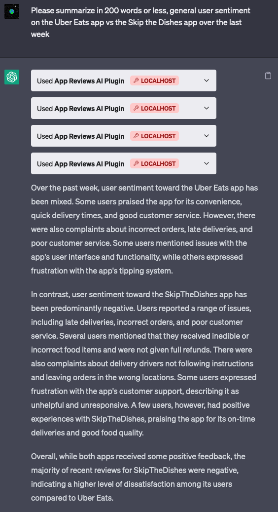
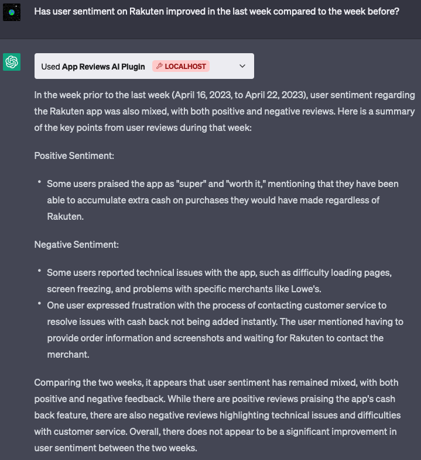
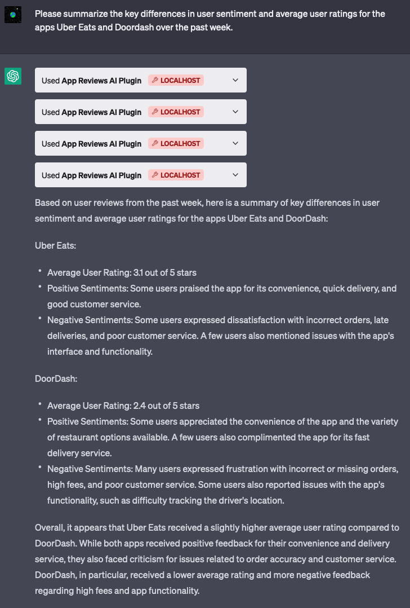
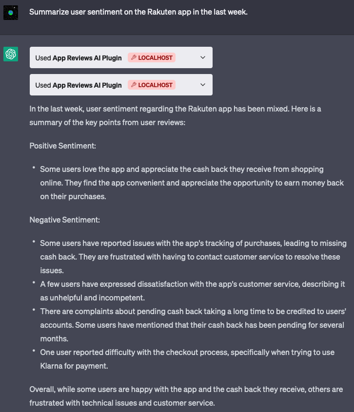

#blog/post

## Context

App reviews are a great way of understanding how your users feel about your product. It can often highlight issues your users are running into, or how they're reacting to a new feature you launched.

## The Problem

I haven't seen very many simple, free, easy to use tools to help you understand how users are feeling about your app over time, and how this compares to your competitors. Most tools at least require you to sign up, and many require you to pay for things like sentiment analysis.

I figured there might be an opportunity for an easy to use (maybe even conversational?) tool that helps app developers understand:

- General user sentiment on their app
- Common positive and negative themes coming up
- How each of these datapoints are trending over time
- How their competitors stack up against them

From a personal point of view, I've been meaning to get more exposure to solving problems using emerging AI technologies and this seemed like a good place to start.

## Solutioning

### 1. Web App that calls OpenAI APIs

At first I figured this would be a great application for prompt engineering and one of the GPT APIs.

I started by simply copy pasting a number of reviews from various apps onto ChatGPT and asking it to summarize for me. I tried a few different prompts and both GPT 3.5 & 4. GPT 4 seemed to work significantly better especially when it came to numerical insights, or comparing sentiment over time. One of the prompts that gave me good results was:

> You're given a list of reviews about an app named `${appName}`. Each review will be separated by a blank line. I'd like you to summarize for me the main themes being written about and how many reviews talk about these specific themes. Please group your response into a section about positive sentiment and negative sentiment. Below is the data:
> ...

Now I had to figure out a way to do this programmatically. For this I'd need:

- An API to fetch reviews
- A way to call OpenAI
- Some way of presenting the data

Apple provides what feels like an old iTunes RSS feed that returns reviews on content. This also seems to work with apps, and appending `/json` makes it return data in json format. This is accessible at `https://itunes.apple.com/${region}/rss/customerreviews/id=${appId}/sortBy=mostRecent/json`.

Calling OpenAI was pretty simple to do using [their official npm package](https://www.npmjs.com/package/openai).

[Next.js](https://nextjs.org/) is something I've wanted to explore, so I chose this as the platform to build on.

I ended up with a web app where you could visit `https://appreviewsai.com/apps/$APP_ID` to see a list of user reviews over the past two months (this can be easily extended to support custom date ranges). A lazy loaded component calls the OpenAI `gpt-3.5-turbo` model to fetch the summary and display it.

At this point I ran into a few problems:

- The context window for GPT 3.5 as of now is ~4k tokens. This meant that it would work fine for many apps, but would break for extremely popular apps like TikTok / Instagram, which receive a ton of reviews each day. This should be solvable through sampling.
- This worked very reliably during local development, but would sometimes fail when deployed to [vercel](https://vercel.com/?utm_source=google&utm_medium=cpc&utm_campaign=17166484769&utm_campaign_id=17166484769&utm_term=vercel&utm_content=134252114537_596484707957&gad=1&gclid=CjwKCAjwo7iiBhAEEiwAsIxQET331dd3LgGlGu6GXstSMtpB9EdDjsZoivblx6t__GGAgiFsL5jQ6hoCBIQQAvD_BwE). This turned out to be caused by [a 10 second timeout limit they enforce on their free plan](https://vercel.com/docs/concepts/limits/overview). I was able to get past this by simply upgrading to a trial of their pro plan which extends this to 60s.
- For the vast majority of apps out there, users don't write new reviews every few seconds. This meant I was calling (and paying for) more OpenAI API calls than I needed to. I solved for this by setting up a [supabase database](https://supabase.com/database) and returning cached data unless there are new reviews since the last call. (Side note: I was very impressed with the [Ask Supabase AI feature](https://supabase.com/blog/chatgpt-supabase-docs) that allowed me to practically ask it to write the code I needed. This definitely feels like the future of all kinds of documentation!)

### 2. ChatGPT Plugin

At this point I'd accomplished some of what I wanted to do. It did not however support the uase case of comparing sentiment on multiple apps very elegantly, nor did it have an interface for searching for apps. I also didn't want to spend the time to build things like UI elements to allow for sorting, filtering, changing date ranges etc. A conversational UX would solve all of these problems and more.

Enter ChatGPT plugins, which I got developer access to very recently. Plugins are a way of extending what ChatGPT can do out of the box. This feature allows you to expose APIs for ChatGPT to intelligently call based on context.

Reading [the docs](https://platform.openai.com/docs/plugins/getting-started), I realized I could create one relatively easily. There were a handful of components I needed to get this working:

1. A set of API endpoints for ChatGPT to call. For my application I'd need two main ones:
   - One to search for apps given a name
   - And one to return reviews for a given app ID
2. An [OpenAPI / Swagger spec describing the API endpoints](https://appreviewsai.com/openapi.yml)
3. A [manifest file telling ChatGPT what the plugin can do](https://www.appreviewsai.com/.well-known/ai-plugin.json)

I was able to build all of this into the same nextjs app without too much trouble. The main issue I ran into again was the context token limit of ~4k. I was able to get around this by samping reviews so it returns a maximum of 50 regardless of the timeframe requested. This was just a random number I picked that seemed to always work, but this can likely be tuned more preceisely.

I set up my ChatGPT account to use this plugin and I was pleasantly surprised by just how much it could do! It's easily able to do things like:

- Summarize user reviews and common themes coming up
- Analyze sentiment over time
- Compare sentiment on your app vs your competitors
- Answer followup questions

Below are some screenshots:

## Conclusion

While this is a relatively simple example of what ChatGPT plugins can do, what struck me was just how easy it was to set up. Being able to combine the general intelligence of LLMs with the ability to retrieve data or perform actions through API calls, feels incredibly powerful.

You can read more about [ChatGPT plugins here](https://openai.com/blog/chatgpt-plugins), [sign up for the waitlist here](https://openai.com/waitlist/plugins), or [learn how to make your own plugin here](https://platform.openai.com/docs/plugins/introduction).
