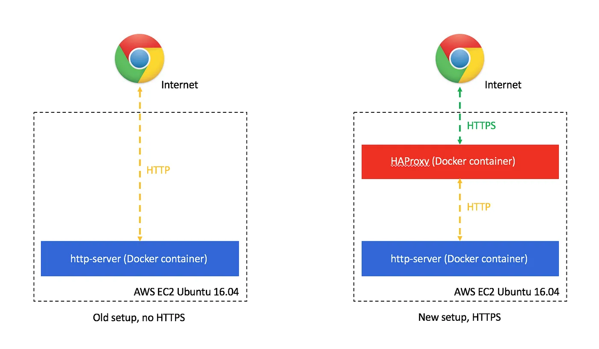
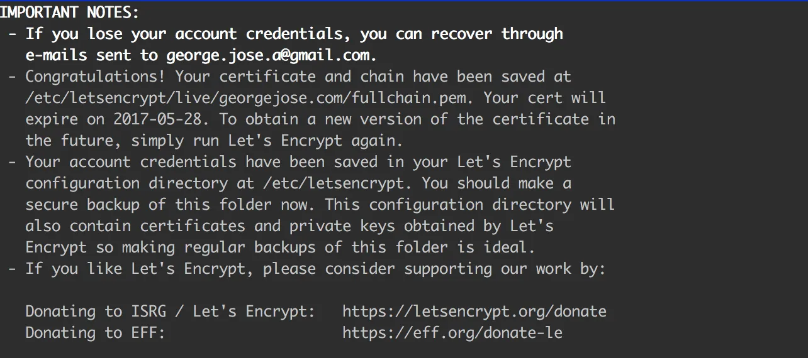

I've had a personal website hosted on an AWS EC2 instance with a domain purchased from Namecheap for a while now. My previous setup involved an express server serving a static directory, and running on port 80 on an AWS EC2 instance. I recently changed this up to instead use HTTPS and decided to write a post explaining how you can do so too!



## **What is HTTPS?**

HTTPS builds upon the Hyper Text Transfer Protocol (HTTP) by adding encryption between the web-server and the user's browser. Chrome, Safari and several other browsers show a lock icon (🔒) in the address bar when viewing a website served over HTTPS.


There are several advantages to using HTTPS:

- Encryption between the browser and the server means a third party in the middle cannot see data being exchanged, ensuring privacy and security.
- HTTPS also protects the integrity of your website by preventing service providers from modifying its contents (ever come across public hotspots that try to inject ads into webpages?).
- HTTPS is the future and is required in order to enable certain modern web browser features such as camera / microphone access, progressive web apps that run offline, service workers etc.
- Better search engine optimization (SEO). Search engines such as Google rank pages secured over HTTPS higher than pages that are not.

You can read more about why you should use https at [https://developers.google.com/web/fundamentals/security/encrypt-in-transit/why-https](https://developers.google.com/web/fundamentals/security/encrypt-in-transit/why-https).

## Technologies used

To set this up, I made use of a few technologies:

- **Docker**  
  Docker is a really cool piece of technology that enables you to create 'containers'. Containers can contain applications along with anything else it needs to run — an OS, libraries, software dependencies, runtimes etc. Think of it as a very lightweight VM. Since all dependencies for an application are contained within the container, the application is guaranteed to run consistently on any host machine that can run Docker itself. You can read more about docker at their official website — [https://www.docker.com/what-docker](https://www.docker.com/what-docker).
  
- **HAProxy**

  HAProxy, or High Availability Proxy is a really popular load balancer and reverse-proxy application. In our setup, we'll use this as a layer to proxy all requests received over HTTPS over to our web server serving static files. We'll also set it up to redirect all HTTP traffic to HTTPS.

- **Let's Encrypt**

  Let's Encrypt is a free, open Certificate Authority (CA) that can issue SSL certificates. We'll use this service to generate a free SSL certificate.
  

# Setup

This is what my setup looked like when I started

- An Ubuntu 16.04 AWS EC2 server that I can SSH into.
- A domain I bought from namecheap, configured to point to my AWS server.
- A static express server serving HTML, CSS, JS.

To start, I went ahead and created two folders on my server to house files for my website and haproxy:

```
|-- personal-website
|-- haproxy
```

## Docker

I used the official docker install script to set up docker on my remote server. I SSH'ed in and entered the following commands to install docker.

```sh
curl -sSL https://get.docker.com/ | sh
```

Instructions on how to set up Docker can be found at [https://docs.docker.com/engine/installation/linux/ubuntu/](https://docs.docker.com/engine/installation/linux/ubuntu/).

## Website

I created the following directory structure in order to keep things tidy. The contents of the website I want published was placed under the `public`folder.

```
# website folder structure

personal-website
|-- Dockerfile
|-- package.json
|-- public/
    |-- index.html
```

I used an npm package called `http-server` to serve my files. To set it up, I simply included it in `package.json` and ran`npm install`.

```json
//package.json
{
  "scripts": {
    "start": "./node_modules/.bin/http-server public -p 3000"
  },

  "dependencies": {
    "http-server": "^0.9.0"
  }
}
```

Running `npm start` and navigating to `http://domain.com:3000` now renders my index.html page.

The next step is to tell docker how to build and run our application. I did this by editing the `Dockerfile`. You can read more about Dockerfiles at [https://docs.docker.com/engine/reference/builder/](https://docs.docker.com/engine/reference/builder/).

```dockerfile
# Dockerfile

# Tell docker what base image to use
FROM node:7.5.0-alpine

# Copy package.json over to the docker container and install packages using npm install
# We copy this here instead of on a later line in order to leverage Docker's caching.
# Caching this is beyond the scope of this post, but you can read more http://bitjudo.com/blog/2014/03/13/building-efficient-dockerfiles-node-dot-js/
COPY ./package.json /packages/package.json

RUN cd /packages/ && npm install -q

# We'll now use /personal_website as our path to run all subsequent commands
WORKDIR /personal_website

# Copy over the npm packages (http-server) to this folder
RUN cp -a /packages/* /personal_website/

# Copy all other contents from the host to the docker container
COPY . /personal_website

# Expose the port we're serving our website on
EXPOSE 8080

# All steps above this run at build time. The step below tells docker what to do when the container is being run.
CMD ["node_modules/.bin/http-server", "public", "-p 8080"]
```

I can now try to build and run this in docker by running the following commands:

```shell
# build the docker image and tag it 'personal-website'
docker build -t personal-website .

# run the image tagged personal-website we just built, with the container's port 8080 bound to the host's port 80
sudo docker run -it -p 80:8080 personal-website
```

🎉 Everything seemed to have worked, and I was able to view my website at `[http://domain.com](http://domain.com/)` (if you're running this on a local machine and not something like an ec2 instance, you should see it at `[http://localhost](http://localhost/)`).

## Let's Encrypt

The next step is to request my SSL certificate using Let's Encrypt. [DigitalOcean has a fantastic guide on how to do this, do check it out if this section is not clear](https://www.digitalocean.com/community/tutorials/how-to-secure-apache-with-let-s-encrypt-on-ubuntu-16-04). Since I already own a domain, and its A Record is set to my ec2 instance's DNS, I'm good to proceed. If you haven't done this already, refer to your domain name provider's documentation. I SSH'ed into my server and ran the following commands to download the *letsencrypt* client.

```shell
sudo apt-get update
sudo apt-get install letsencrypt
```

In order to obtain an SSL certificate, I now need to prove that I own the domain I'm getting the certificate for. letsencrypt lets me do this by automatically placing a secret file in a specified folder which will be served over the internet on my domain.

The next part was easier with two terminals open side by side open. On one of them, I ran `http-server` to serve a folder named `ssl`.

```shell
# install the http-server npm package on our host machine
sudo npm install -g http-server

# create a folder for letsencrypt to place a secret file in order to prove ownership of the domain
mkdir ssl/

# serve this folder on our domain for the letsencrypt server to check ownership
sudo http-server ssl -p 80
```

I used the other terminal to run the letsencrypt client.

```shell
# Replace domain.com with the domain you would like to get the certificate for
sudo letsencrypt certonly --webroot -w ssl/ -d domain.com
```

At this point I'm asked to provide an email address and to agree to terms and conditions. If everything worked, you'll be greeted with a message that provides the location of your certificate.



👍 I now have an SSL certificate!

## HAProxy

The final piece is to set up HAProxy. To keep things simple, I used the official haproxy docker image to do this.

I created the following folder structure:

```
# HAProxy folder structure
HAProxy
|-- Dockerfile
|-- haproxy.cfg
|-- private/
|-- domain.com.pem # place the ssl certificate you obtained here
```

I updated `Dockerfile` to the following:

```dockerfile
# Dockerfile

# Use the offical haproxy base image
FROM haproxy:1.7

# Copy our haproxy configuration into the docker container
COPY haproxy.cfg /usr/local/etc/haproxy/haproxy.cfg

# Copy our ssl certificate into the docker container
COPY private/domain.com.pem /private/domain.com.pem

# HAProxy requires a user & group named haproxy in order to run
RUN groupadd haproxy && useradd -g haproxy haproxy

# HAProxy also requires /var/lib/haproxy/run/haproxy/ to be created before it's run
RUN mkdir -p /var/lib/haproxy/run/haproxy/
```

The `haproxy.cfg` file looked something like this:

```shell
#haproxy.cfg
global
chroot /var/lib/haproxy
user haproxy
group haproxy
pidfile /var/run/haproxy.pid

# Default SSL material locations
ca-base /usr/local/etc/ssl/certs
crt-base /usr/local/etc/ssl/private

# Default ciphers to use on SSL-enabled listening sockets.
ssl-default-bind-options no-sslv3 no-tls-tickets force-tlsv12
ssl-default-bind-ciphers ECDH+AESGCM:DH+AESGCM:ECDH+AES256:DH+AES256:ECDH+AES128:DH+AES:ECDH+3DES:DH+3DES:RSA+AESGCM:RSA+AES:RSA+3DES:!aNULL:!MD5:!DSS

spread-checks 4
tune.maxrewrite 1024
tune.ssl.default-dh-param 2048
defaults
mode http
balance roundrobin
option dontlognull
option dontlog-normal
option redispatch
maxconn 5000
timeout connect 5s
timeout client 20s
timeout server 20s
timeout queue 30s
timeout http-request 5s
timeout http-keep-alive 15s
frontend www-http
bind 0.0.0.0:80
reqadd X-Forwarded-Proto:\ http
default_backend www-backend
frontend www-https

#Replace this with the name of your ssl certificate
bind 0.0.0.0:443 ssl crt /private/domain.com.pem

reqadd X-Forwarded-Proto:\ https
default_backend www-backend
backend www-backend

# Tell haproxy to redirect all http traffic to https
redirect scheme https if !{ ssl_fc }
server www-1 0.0.0.0:8080 check
```

I can now test it out in docker by running:

```shell
# Build haproxy container
docker build -t haproxy .

# Run the haproxy container
# We tell the container to use the host's network adaptor, instead of the default 'bridge' mode.
# Among other things, this enables one container to access ports on another container.
# Docker networking is out of scope of this post, but you can read more about it at https://docs.docker.com/engine/userguide/networking/
docker run --net=host -it haproxy
```

Navigating to [https://domain.com](https://domain.com/)` now shows me my website! Trying to access `[http://domain.com](http://domain.com/) instead automatically redirects me to [https://domain.com](https://domain.com./)

# Finishing up

Now that I have everything set up, I can run docker containers on my server in the background using the `-d` flag. This way our docker containers remain running even after I terminate our SSH session. In order to ensure my application is restarted with the host machine is restarted, or if it crashes due to an error, I'll also use the `--restart` flag to specify restart behavior.

```shell
# build and run the personal-website container
cd personal-website
docker build -t personal-website .
docker run -d -p 8080:8080 --restart always personal-website

# build and run the haproxy container
cd ../haproxy/
docker build -t haproxy .
docker run -d --net=host --restart always haproxy
```

🎉 I now have a website served over HTTPS!

If you run into issues setting all this up, feel free to leave a comment, or check out my [personal-website](https://github.com/G2Jose/personal-website) and [haproxy](https://github.com/G2Jose/haproxy) set up on github.
